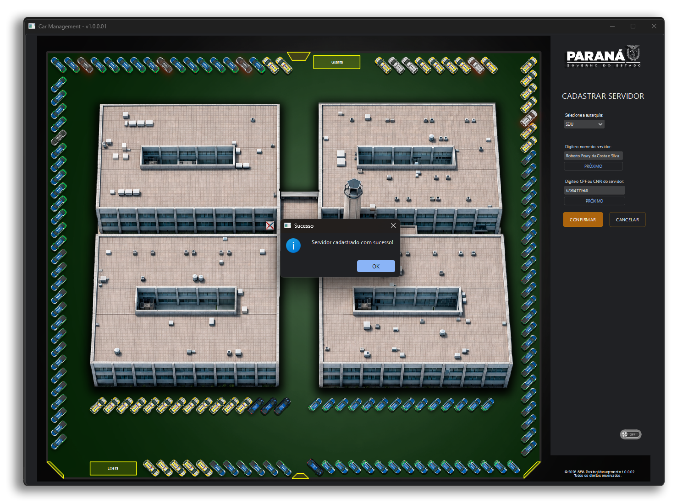

##  Project Parking Management v 1.0.0.02
##  Software de Controle de Estacionamento Institucional
##  Desenvolvido pela Diretoria de Inovação (DIN), vinculado a Secretaria da Inovação em Inteligência Artificial (SEIA)


## PREPARANDO O AMBIENTE:

 ### DEPENDÊNCIAS NECESSÁRIAS:
	• ```winget install Python.Python.3.13```
	• ```pip install pyside6```
	• ```pip install pyqtdarktheme```
	• ```pip install pymysql```
	• ```pip install cryptography```
	• ```pip install pypdf```
	• ```pip install reportlab```

 ### CONFIGURANDO O BANCO:
	  NOTA: instalar o mysql server 8.0 e setar as variaveis de ambiente se for necessário.
	• Modificar as variaveis globais USER e PASSWORD do arquivo SEIAParkingManagement.py 
	  com as credenciais do seu banco de dados;
 	• Entrar no banco via cmd e executar os códigos:
		```source C:(caminho_para_projeto)\SEIAParkingManagement\database\seia_parking.sql```
		```source C:(caminho_para_projeto)\SEIAParkingManagement\database\autarquia.sql```
		```source C:(caminho_para_projeto)\SEIAParkingManagement\database\vagas.sql```
		```source C:(caminho_para_projeto)\SEIAParkingManagement\database\carros.sql```
	 
 
 ### CONFIGURAÇÕES FINAIS:
	• ```executar "pip install --upgrade PySide6 pyqtdarktheme"```


## INTERFACE DA APLICAÇÃO:

	

	

	

	

	
