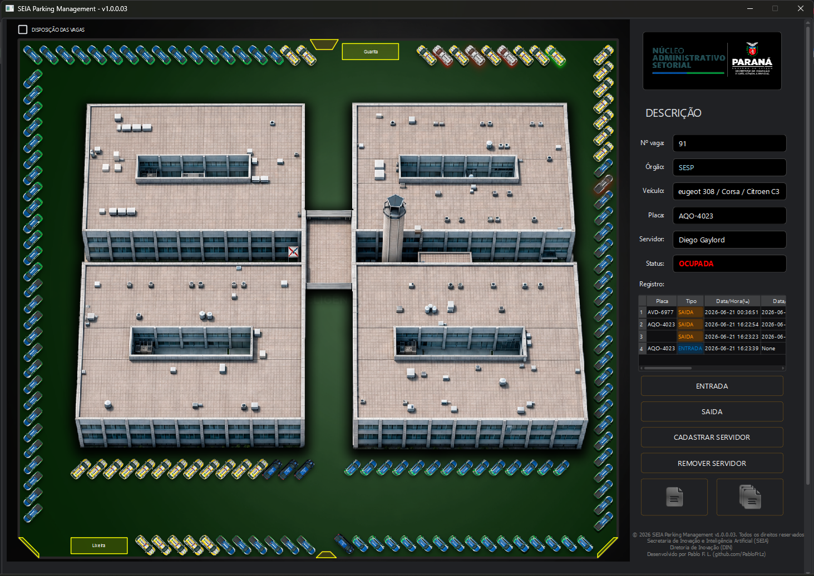
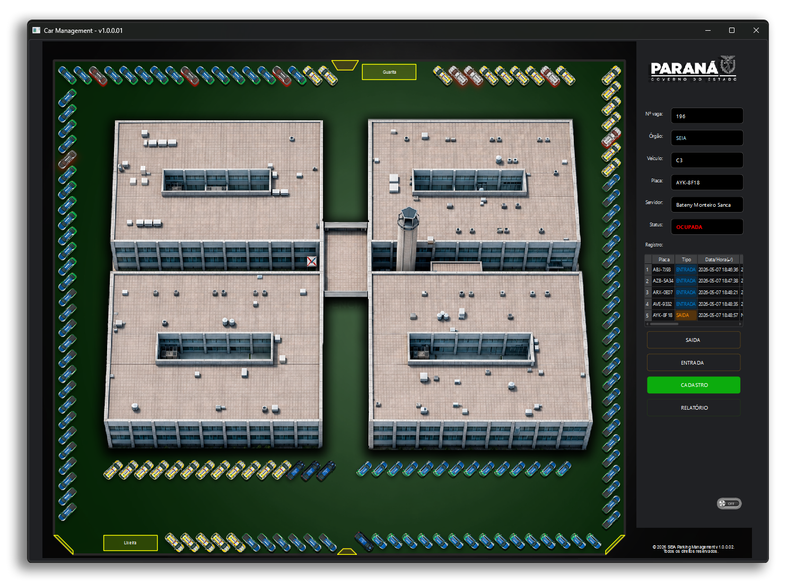
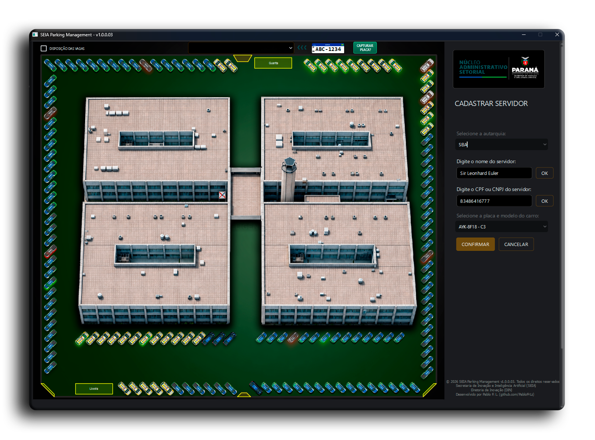
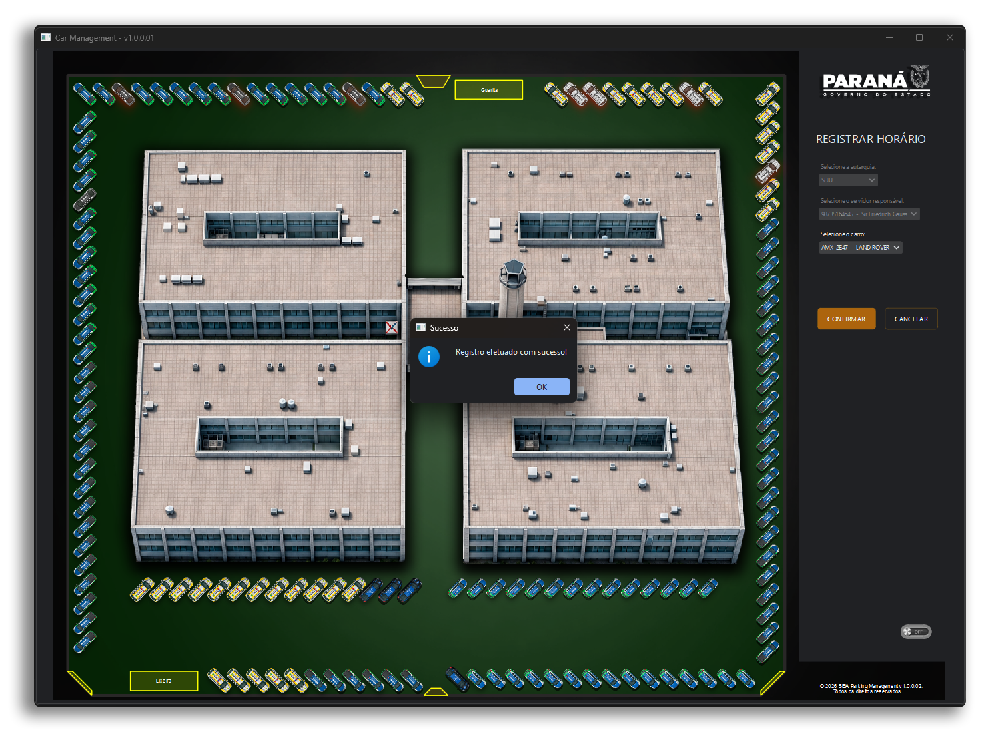

# SEIA Parking Management v1.0.0.03
**Software de Controle de Estacionamento Institucional**  
Desenvolvido pela Diretoria de Inovação (DIN), vinculado à Secretaria da Inovação em Inteligência Artificial (SEIA)

## CONFIGURANDO O AMBIENTE

### DEPENDÊNCIAS NECESSÁRIAS:

```bash
winget install Python.Python.3.12
pip install pyside6
pip install pyqtdarktheme
pip install pymysql
pip install cryptography
pip install pypdf
pip install reportlab
```

 ## CONFIGURANDO O BANCO:
	  NOTA: instalar o mysql server 8.0 e setar as variaveis de ambiente se for necessário.
	• Modificar as variaveis globais USER e PASSWORD do arquivo SEIAParkingManagement.py 
	  com as credenciais do seu banco de dados;
 	• Entrar no banco via cmd e executar os códigos:
```bash
source C:(caminho_para_projeto)\SEIAParkingManagement\database\seia_parking.sql
source C:(caminho_para_projeto)\SEIAParkingManagement\database\autarquia.sql
source C:(caminho_para_projeto)\SEIAParkingManagement\database\vagas.sql
source C:(caminho_para_projeto)\SEIAParkingManagement\database\carros.sql
```

 ## PREDIÇÃO DE PLACAS (OCR):
```bash
pip install requests
pip install pillow
python312 -m pip install paddlepaddle==3.2.0 paddleocr==3.3.3
```	 
 
 ## CONFIGURAÇÕES COMPLEMENTARES:
```bash
pip install --upgrade PySide6 pyqtdarktheme"
```

 ## CRIAÇÃO DO EXECUTÁVEL PYTHON:
```bash
pip install pyinstaller

pyinstaller --onefile --windowed --clean ^
    --icon=icone.ico ^
    --version-file version_info.txt ^
    --add-data "imagens;imagens" ^
    SEIAParkingManagement.py
```

### Caso dê problemas de conflito entre PyQt5 e PySide6 com o erro "ERROR: Aborting build process due to attempt to collect multiple Qt bindings packages: attempting to run hook for 'PyQt5', while hook for 'PySide6' has already been run!". Execute o comando: 
```bash
pyinstaller --onefile --windowed --clean ^
    --icon=icone.ico ^
    --version-file version_info.txt ^
    --add-data "imagens;imagens" ^
    --exclude-module PyQt5 ^
    --exclude-module PyQt5.QtCore ^
    --exclude-module PyQt5.QtGui ^
    --exclude-module PyQt5.QtWidgets ^
    SEIAParkingManagement.py
```


## Interface da Aplicação





