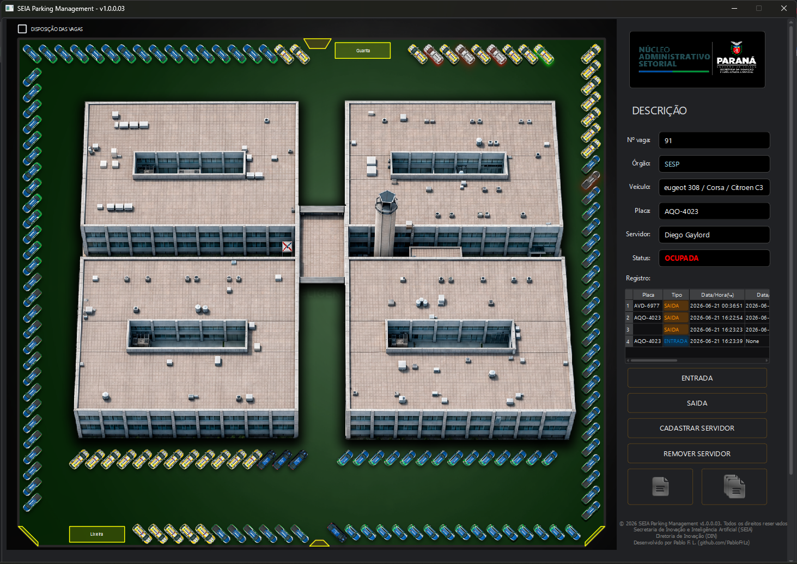
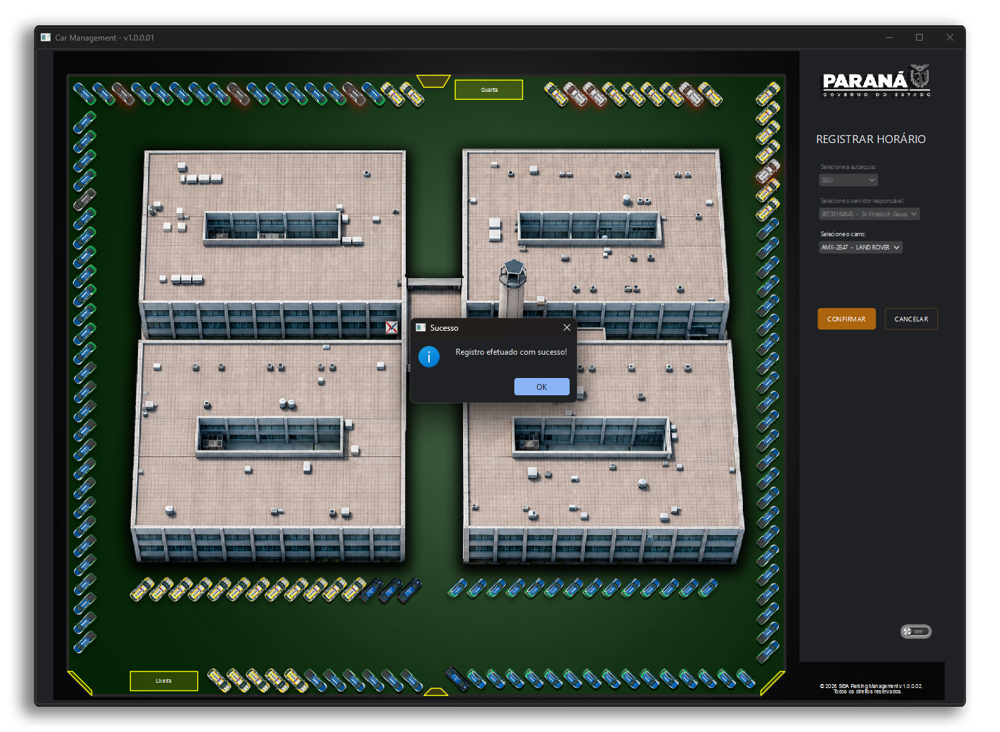
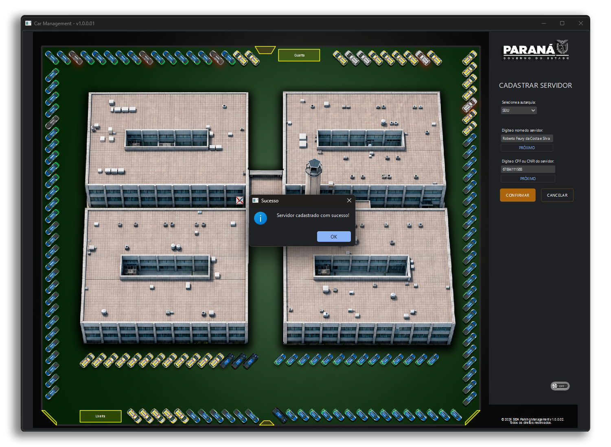
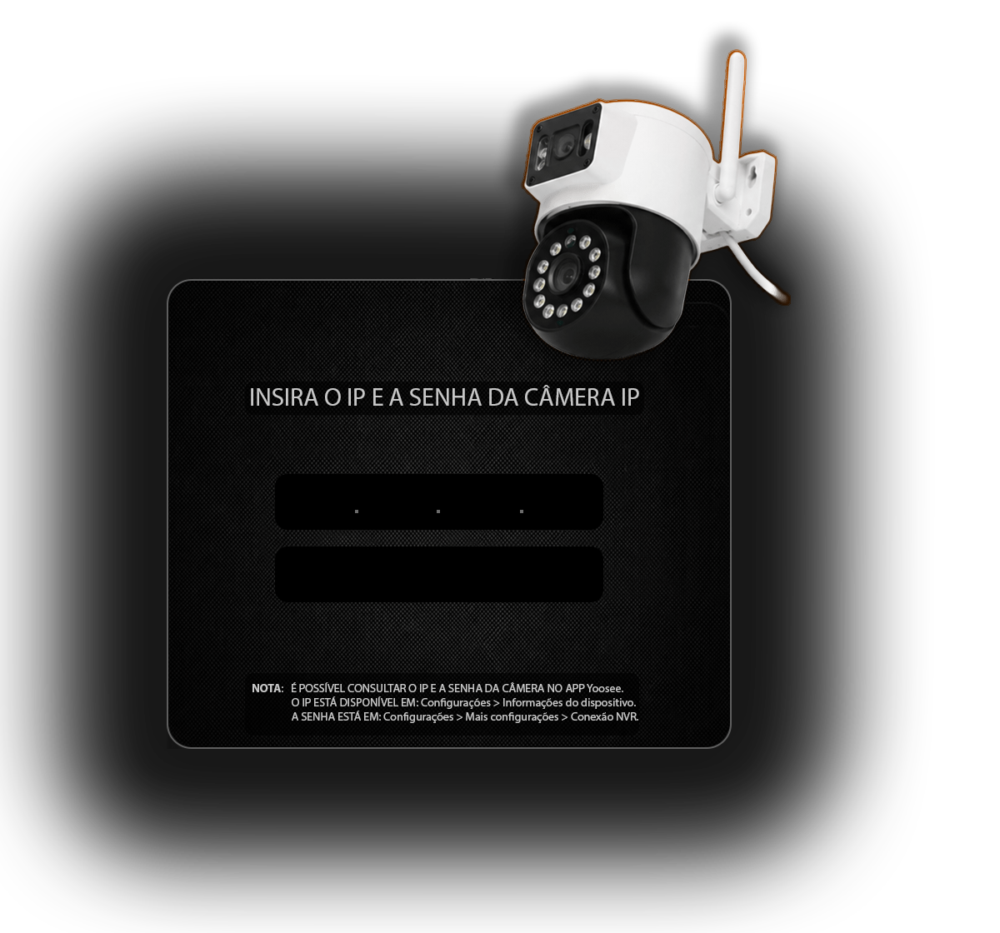

 # SEIA Parking Management v1.0.0.03
**Software de Controle de Estacionamento Institucional**  
Desenvolvido para o Núcleo Administrativo Setorial (NAS), vinculado à Secretaria da Inovação em Inteligência 
Artificial (SEIA), do estado do Paraná. O objetivo era o gerenciamento das entradas e saidas de veículos nas
dependencias do prédio onde está situado as Secretarias de Estado do Paraná, no bairro Hauer em Curitiba.
```
**Arquivos com dados restritos da Secretaria foram omitidos, atendendo ao que determina a LGPD.**
```

 ## Interfaces da Aplicação




 ## CONFIGURANDO O AMBIENTE

 ### DEPENDÊNCIAS NECESSÁRIAS:

```bash
winget install Python.Python.3.12
pip install pyside6
pip install pyqtdarktheme
pip install pymysql
pip install cryptography
pip install pypdf
pip install reportlab
winget install ffmpeg
```

 ## CONFIGURANDO O BANCO:
	  NOTA: instalar o mysql server 8.0 e setar as variaveis de ambiente se for necessário.
	• Modificar as variaveis globais USER e PASSWORD do arquivo SEIAParkingManagement.py 
	  com as credenciais do seu banco de dados;
 	• Entrar no banco via cmd e executar os códigos:

```bash
source C:(caminho_para_projeto)\SEIAParkingManagement\database\seia_parking.sql
source C:(caminho_para_projeto)\SEIAParkingManagement\database\autarquia.sql
source C:(caminho_para_projeto)\SEIAParkingManagement\database\vagas.sql
```
    • E depois carregar os demais dados no banco na seguinte sequencia:
```bash
// servidores.sql
// carros.sql
``` 

 ## CONFIGURAÇÕES COMPLEMENTARES:
```bash
pip install --upgrade PySide6 pyqtdarktheme"
```

 ## PREDIÇÃO DE PLACAS (OCR):



Para predição de placas, foi usado a biblioteca PaddleOCR v3.3.3 e PaddlePaddle v3.2.0.
O modelo de visão computacional usado é o **PP-OCRv5_server**. 
```bash
pip install requests
pip install pillow
python312 -m pip install paddlepaddle==3.2.0 paddleocr==3.3.3
```	 
Em complemento, uma Câmera IP WiFi (QC:06 HXWS) foi usada como dispositivo auxiliar de captura 
das imagens das placas dos veículos. Foi utilizado recursos de RTSP da câmera em conjunto com o
FFMPEG para o envio de comandos para captura das imagens. 
O app usado para configurar a câmera é o Yoosee ver. 6.44.1.
É preciso ler manualmente o endereço IP da câmera que o roteador fornece randomicamente ao configurar
a câmera pela primeira vez.
```
O IP está disponível em: Configurações > Informações do dispositivo.
```
É preciso também ativar e fornecer a senha de conexões NVR fornecido pelo app:
```
A ativação ocorre em: Configurações > Mais Configurações > Conexão NVR.
A senha também é gerada nessa opção.
```



Após configurar, é possível testar com o VLC Media Player em:
```
Mídia > Abrir Transmissão de Rede > Rede
```
insira a URL **rtsp://admin:PASSWORD@IP_CAMERA:554/onvif** substituindo **PASSWORD** pela senha
e **IP_CAMERA** pelo o IP da camera que foi atribuído pelo roteador. É possível testar também com o 
utilitário telnet:
```
telnet IP_CAMERA 554
```
ou via powershell, com:
```
Test-NetConnection -ComputerName IP_CAMERA -Port 554
```
Se a câmera não estiver visível na rede, certifique-se de estar conectado na mesma rede Wi-Fi da câmera.
Se a conexão for bem estabelecida, já será possível fazer uso do recurso de OCR.
 
 ## CRIAÇÃO DO EXECUTÁVEL PYTHON:
```bash
pip install pyinstaller

pyinstaller --onedir --console --clean ^
    --collect-data paddlex --collect-data paddleocr ^
    --copy-metadata paddlex ^
    --copy-metadata paddleocr ^
    --copy-metadata paddlepaddle ^
    --copy-metadata pyclipper ^
    --copy-metadata shapely ^
    --copy-metadata imagesize ^
    --copy-metadata opencv-contrib-python ^
    --copy-metadata pypdfium2 ^
    --copy-metadata python-bidi ^
    --copy-metadata safetensors ^
    --icon=icone.ico ^
    --version-file version_info.txt ^
    --add-data "imagens;imagens" ^
    SEIAParkingManagement.py
```

 ### Caso dê problemas de conflito entre PyQt5 e PySide6 com o erro "ERROR: Aborting build process due to attempt to collect multiple Qt bindings packages: attempting to run hook for 'PyQt5', while hook for 'PySide6' has already been run!". Execute o comando: 
```bash
pyinstaller --collect-data paddlex --collect-data paddleocr --onefile --windowed --clean ^
    --icon=icone.ico ^
    --version-file version_info.txt ^
    --add-data "imagens;imagens" ^
    --exclude-module PyQt5 ^
    --exclude-module PyQt5.QtCore ^
    --exclude-module PyQt5.QtGui ^
    --exclude-module PyQt5.QtWidgets ^
    SEIAParkingManagement.py
```


