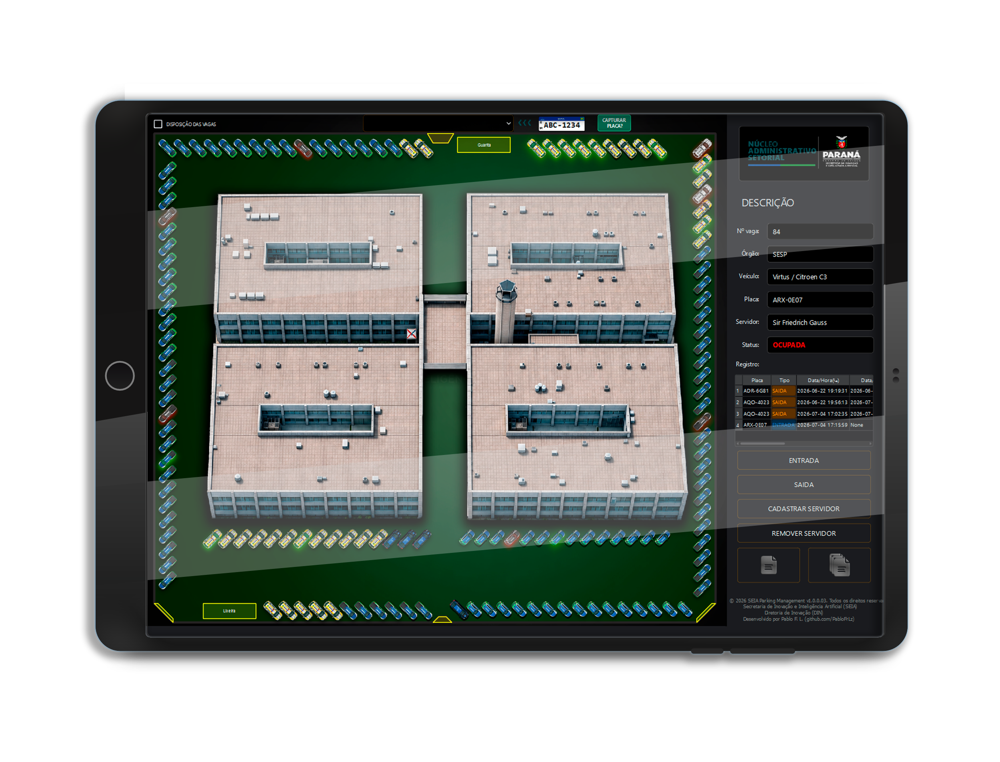

 # SEIA Parking Management v1.0.0.03
**Software de Gestão de Estacionamento**  
Desenvolvido para o Núcleo Administrativo Setorial (NAS), vinculado à Secretaria da Inovação em Inteligência 
Artificial (SEIA), do estado do Paraná. O objetivo era o gerenciamento das entradas e saidas de veículos nas
dependências do prédio onde está situado as Secretarias de Estado do Paraná, no bairro Hauer em Curitiba.
```
**Arquivos com dados restritos da Secretaria foram omitidos, atendendo ao que determina a LGPD.**
```

 ## Interfaces da Aplicação


 ## CONFIGURANDO O AMBIENTE

 ### DEPENDÊNCIAS NECESSÁRIAS

```bash
winget install Python.Python.3.12
pip install pyside6
pip install pyqtdarktheme
pip install pymysql
pip install cryptography
pip install pypdf
pip install reportlab
winget install ffmpeg
```

 ## CONFIGURANDO O BANCO
	  NOTA: instalar o mysql server 8.0 e setar as variaveis de ambiente se for necessário.
	• Modificar as variaveis globais USER e PASSWORD do arquivo SEIAParkingManagement.py 
	  com as credenciais do banco de dados;
 	• Entrar no banco via cmd (mysql -u user -p) ou via MySQL 8.0 Command Line Client e executar os códigos:

```bash
source C:(caminho_para_projeto)\SEIAParkingManagement\database\seia_parking.sql
source C:(caminho_para_projeto)\SEIAParkingManagement\database\autarquia.sql
source C:(caminho_para_projeto)\SEIAParkingManagement\database\vagas.sql
```
    • E depois carregar os demais dados no banco na seguinte sequencia:
```bash
// servidores.sql
// carros.sql
``` 

 ## CONFIGURAÇÕES COMPLEMENTARES
```bash
pip install --upgrade PySide6 pyqtdarktheme"
```

 ## PREDIÇÃO DE PLACAS (OCR)


Para predição de placas, foi usado a biblioteca PaddleOCR v3.3.3 e PaddlePaddle v3.2.0.
O modelo de visão computacional usado é o **PP-OCRv5_server**. 
```bash
pip install requests
pip install pillow
python312 -m pip install paddlepaddle==3.2.0 paddleocr==3.3.3
```	 
Em complemento, uma Câmera IP WiFi (QC:06 HXWS) foi usada como dispositivo auxiliar de captura 
das imagens das placas. Foi utilizado recursos de RTSP da câmera em conjunto com o FFMPEG para 
o envio de comandos para captura das imagens. O app usado para configurar a câmera é o Yoosee 
ver. 6.44.1. Ao iniciar a aplicação, será preciso ler manualmente o endereço IP da câmera que 
o roteador fornece randomicamente ao configurar a câmera pela primeira vez.
O IP está disponível em: 
```
Configurações > Informações do dispositivo.
```
É preciso também ativar e fornecer a senha de conexões NVR fornecido pelo app:
A ativação ocorre em: 
```
Configurações > Mais Configurações > Conexão NVR.
```
A senha é gerada durante a ativação.


Após configurar, é possível testar o stream da câmera com o VLC Media Player em:
```
Mídia > Abrir Transmissão de Rede > Rede
```
insira a URL **rtsp://admin:PASSWORD@IP_CAMERA:554/onvif1** substituindo **PASSWORD** pela senha
e **IP_CAMERA** pelo o IP da camera que foi atribuído pelo roteador. É possível testar também com o 
utilitário telnet:
```
telnet IP_CAMERA 554
```
ou via powershell, com:
```
Test-NetConnection -ComputerName IP_CAMERA -Port 554
```
Se a câmera não estiver visível na rede, certifique-se de estar conectado na mesma rede Wi-Fi da câmera.
Se a conexão for bem estabelecida, já será possível fazer uso do recurso de OCR.
 
 ## CRIAÇÃO DO EXECUTÁVEL PYTHON
```bash
pip install pyinstaller

pyinstaller --onedir --console --clean ^
    --collect-data paddlex --collect-data paddleocr ^
    --copy-metadata paddlex ^
    --copy-metadata paddleocr ^
    --copy-metadata paddlepaddle ^
    --copy-metadata pyclipper ^
    --copy-metadata shapely ^
    --copy-metadata imagesize ^
    --copy-metadata opencv-contrib-python ^
    --copy-metadata pypdfium2 ^
    --copy-metadata python-bidi ^
    --copy-metadata safetensors ^
    --add-binary "C:\Users\Usuario\AppData\Local\Programs\Python\Python312\Lib\site-packages\paddle\libs\mklml.dll;paddle/libs" ^
    --icon=icone.ico ^
    --version-file version_info.txt ^
    --add-data "imagens;imagens" ^
    SEIAParkingManagement.py
```

 ### Caso o ambiente esteja com PySide6 instalado e dê problemas de conflito entre PyQt5 e PySide6: "ERROR: Aborting build process due to attempt to collect multiple Qt bindings packages: attempting to run hook for 'PyQt5', while hook for 'PySide6' has already been run!". Tente a correção com: 
```bash
pyinstaller --onedir --console --clean ^
    --collect-data paddlex --collect-data paddleocr ^
    --copy-metadata paddlex ^
    --copy-metadata paddleocr ^
    --copy-metadata paddlepaddle ^
    --copy-metadata pyclipper ^
    --copy-metadata shapely ^
    --copy-metadata imagesize ^
    --copy-metadata opencv-contrib-python ^
    --copy-metadata pypdfium2 ^
    --copy-metadata python-bidi ^
    --copy-metadata safetensors ^
    --add-binary "C:\Users\Usuario\AppData\Local\Programs\Python\Python312\Lib\site-packages\paddle\libs\mklml.dll;paddle/libs" ^
    --icon=icone.ico ^
    --version-file version_info.txt ^
    --add-data "imagens;imagens" ^
    --exclude-module PyQt5 ^
    --exclude-module PyQt5.QtCore ^
    --exclude-module PyQt5.QtGui ^
    --exclude-module PyQt5.QtWidgets ^
    SEIAParkingManagement.py
```

 ## INTEGRAÇÃO COM AMBIENTE ANDROID



É preciso realizar o procedimento dentro do Ubuntu ou WSL.
Também é preciso ter o *pyside6-android-deploy*: https://doc.qt.io/qtforpython-6/deployment/deployment-pyside6-android-deploy.html.
Certifique-se de ter o android SDK 34 e o .JAR do PySide6 nos caminhos especificados abaixo:
```bash
SDK_PATH=~/.pyside6_android_deploy/android-sdk
NDK_PATH=~/.pyside6_android_deploy/android-sdk/ndk/26.1.10909125
RECIPE_DIR=$PROJECT_DIR/deployment/recipes
JARS_DIR=$PROJECT_DIR/deployment/jar/PySide6/jar
```
Execute o script ```build_manual.sh``` na pasta do projeto no wsl Ubuntu.
Recomendado usar ambiente venv com python 3.11.15 e todas as demais dependencias. 
É preciso conceder permissões extras com:
```bash
    sudo chmod +x build_manual.sh 
```

 ### Instalação
Ao obter o arquivo.apk, baixe o adb.exe e entre no diretorio ```\platform-tools``` do adb.exe.
Depois copie o arquivo.apk de dentro do WSL/Ubuntu para dentro de ```\platform-tools``` com:
```bash
    copy \\wsl$\Ubuntu\home\seia\SEIAParkingManagement\SEIAParkingManagement-0.1-arm64-v8a-debug.apk C:\Users\Usuario\Downloads\platform-tools

    # modificar o caminho conforme necessário.
```
Ative a DEPURAÇÃO USB no dispositivo android e depois verifique se o dispositivo android foi reconhecido com:
```bash
    ./adb.exe devices

    # É esperado uma resposta com o nome do dispositivo:
    # List of devices attached
    # R9XT3030F9T     device
    # 
```
Instale o APK com:
```bash
    .\adb.exe install SEIAParkingManagement-0.1-arm64-v8a-debug.apk

    # Certifique-se que o nome do arquivo.apk esteja correto.
```
Caso dê um erro do tipo ```adb.exe: failed to install SEIAParkingManagement-0.1-arm64-v8a-debug.apk: Failure [INSTALL_FAILED_VERIFICATION_FAILURE: Install not allowed for file:///data/app/vmdl834578893.tmp]```.
Desative a verificação de apps oficiais do android com:
```bash
    .\adb.exe shell settings put global verifier_verify_adb_installs 0
```
 ### Configuração de IP Fixo
Para se comunicar com o banco de dados MySQL que esta rodando em um PC a partir do dispositivo android,
é preciso fazer ele (MySQL) responder a requisições de fora da rede local. Veja como configurar isso diretamente
com alguma IA. Depois de configurar o MySQL, é preciso configurar um IP Fixo. No Windows, basta ir em: 
```bash
Adaptador de rede > Propriedades > Protocolo IPV4:
    Usar o seguinte endereço IP:
        192.168.0.236 *ou outro IP fixo*
        255.255.255.0
        192.168.0.1
    Usar o seguinte servidor DNS:
        192.168.0.1 
```
Depois de obter o ip fixo, basta inserir manualmente em *SEIAParkingManagement.py* no seguinte trecho:
```bash
    self.conn = pymysql.connect(
        host='IP_FIXO',
        user=USER,
        password=PASSWORD,
        database='seia_parking'
    )
```
Caso já tenha criado um arquivo.apk, execute apenas o ```build_manual_etapa_2.sh``` para gerar outro arquivo.apk.

 ### Debug
Para debug durante o processo, recomenda usar o logcat:
```bash
    .\adb.exe logcat -c
``` 

Depois salve o log:
```bash
    .\adb.exe logcat -d > log_completo.txt
```
